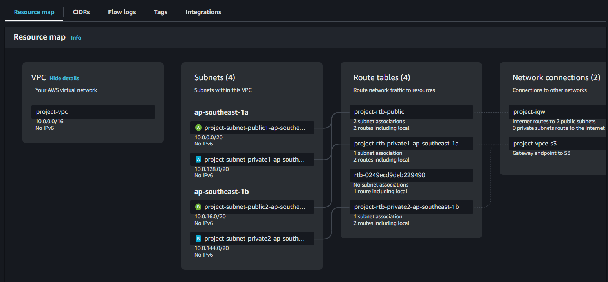
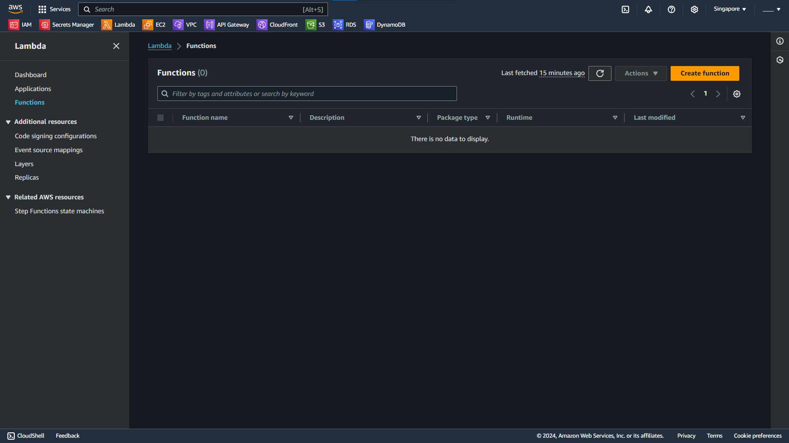
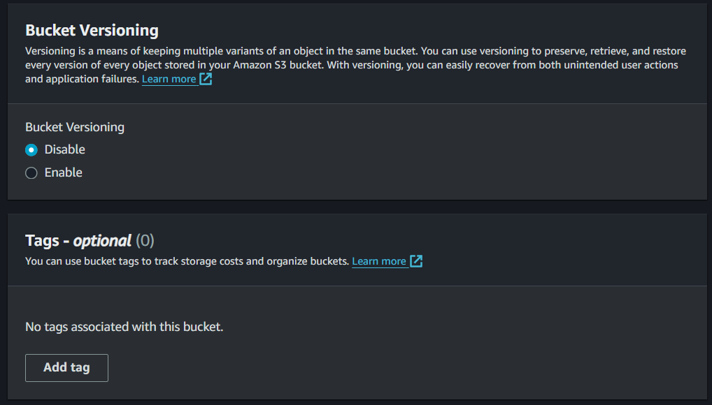

## Bước 1: Tạo VPC
### Tạo VPC.
Truy cập vào [trang VPC](https://ap-southeast-1.console.aws.amazon.com/vpcconsole/home?region=ap-southeast-1#Home) để tạo VPC.


Khi vào trang giao diện, chọn **Create VPC**.


Ở đây, chọn **VPC and more**. Đặt tên theo ý muốn bản thân, còn lại giữ nguyên các cài đặt mặc định của VPC.
Sau đó ấn **Create VPC**


Sau khi tạo xong, ấn **View VPC**.


Kiểm tra xem **Resource map** có giống như trên hình ảnh không.
Thế là tạo thành công **VPC** cho dự án.

### Tạo Security Group.
Truy cập [trang Security Group](https://ap-southeast-1.console.aws.amazon.com/vpcconsole/home?region=ap-southeast-1#SecurityGroups:) để tạo **Security Group** cho dự án.


Chọn **Create security group**. Đặt tên **Security Group** và **Description** theo ý muốn bản thân. Sau đó phần **VPC** chọn cái vừa tạo lúc nãy.


Phần **Inbound rules**, chọn **Add Rule**. Phần **Type** chọn *All trafic*, phần **Source** chọn *Anywhere-IPv4*. Làm thêm một cái nữa cho *Anywhere-IPv6*.


> Không nên để cấu hình **Inbound Rules** như trên vì sẽ cho phép tất cả lưu lương internet truy cập vào dịch vụ AWS.

Phần **Outbound rules**, làm tương tự như trên.


Kéo xuống dưới cuối trang, ấn **Create security group** để tạo **Security group**. Ẫn xong, ta sẽ có giao diện:


Xong bước 1 là tạo **VPC**.

## Bước 2: Tạo EC2
### Tạo Key Pair để kết nối SSH
Truy cập [trang Key Pairs](https://ap-southeast-1.console.aws.amazon.com/ec2/home?region=ap-southeast-1#KeyPairs:) để tạo **Key Pair**. Ấn **Create key pair**.


Ta đặt tên cho **Key pair** rồi ấn **Create key pair**. Để cài đặt giống như ảnh.


Trang web sẽ tải về cho ta một tệp tin chưa key. Ta sẽ sử dụng nó sau. Thế là xong bước tạo **Key pair**

### Khởi tạo EC2
Try cập [Trang Instances](https://ap-southeast-1.console.aws.amazon.com/ec2/home?region=ap-southeast-1#Instances:v=3;$case=tags:true%5C,client:false;$regex=tags:false%5C,client:false) để tạo **EC2**. Sau khi truy cập, ta chọn **Launch instances**.


#### Name and tags.
Phần này là phần đặt tên cho **EC2**. Ta có thể chọn tên gì mà ta muốn.


#### Application and OS Images (Amazon Machine Image).
Phần này là nơi ta chọn hệ điều hành cho **EC2**, có thể là windows, linux hoặc ubuntu, tùy vào mục đích sử dụng của chúng ta. Bài tập này, mục đích sử dụng chính là để kết nối với **RDS** nên giữ nguyên là **Amazon Linux**. Phần **Amazon Machine Image**, chọn **Amazon Linux 2023 AMI**. Tiếp theo là **Architecture**, ta chọn **64-bit (x86)**.


#### Instance type.
Phần này, ta sẽ chọn cấu hình phần cứng cho **EC2**. Ta sẽ sử dụng **t2.micro**.


#### Key pair (login).
Phần **Key pair** giúp ta kết nối với **EC2** thông qua SSH. Ta sẽ sử dụng key tạo vừa nãy.


#### Network settings.
Phần này cho ta cấu hình mạng của **EC2**. Ta chọn **Edit**.
1. **VPC**: chọn **VPC** tạo ở phần trên.
2. **Subnet**: chọn 1 trong 2 **Public Subnet**.
3. **Auto-assign public IP**: chọn **Enable** để hệ thống tự động gán địa chi IPv4 cho **EC2**.
4. **Firewall (security groups)**: chọn **Select existing security group**. Sau đó chọn **Security group** tạo ở trên.


#### Configure storage.
Ta giữ nguyên, không cần thay đổi gì cả.


#### Advanced details.
Ta cũng giữ nguyên.


Sau khi chọn các cài đặt trên. Ta ấn **Launch instance**.


Thế là xong bước tạo **EC2**.

## Bước 3: Tạo Amazon RDS
### Tạo cơ sở dữ liệu
Ta truy cập trang [Trang Amazon RDS](https://ap-southeast-1.console.aws.amazon.com/rds/home?region=ap-southeast-1) để tạo cơ sở dữ liệu. Sau khi truy cập, ta chọn **Create database**.


#### Choose a database creation method
Ta chọn **Standard create**.


#### Engine options
Ta chọn **MySQL**. Phần **Engine version**, ta chọn phiên bản **8.0.x**.


#### Templates
Ta chọn **Free tier**.


#### Availability & durability
Ta không cần để ý.


#### Settings
* **DB instance identifier**: ta đặt tên theo ý muốn.
* **Credentials Settings**: (tự chọn)
  * Master username: admin
  * Master password: admin123


#### Instance configuration
Ta giữ nguyên cài đặt của Amazon.


#### Storage
Ta giữ nguyên cài đặt.


#### Connectivity 
* **Compute resource**: chọn **Connect to an EC2 compute resource**
* **EC2 instance**: chọn **EC2** vừa tạo ban nãy.
* **VPC security group (firewall)**: chọn **security group** tạo ở phần **VPC**.
* **Còn lại**: giữ nguyên.


#### Tags - optional
Ta giữ nguyên.


#### Database authentication
Ta giữ nguyên.


#### Monitoring
Ta giữ nguyên.


#### Additional configuration
Ta giữ nguyên.


Sau đó ta ấn **Create database** và chờ nó tạo xong.

### Kết nối với RDS thông qua MySQL Workbench
Để tiếp tục, yêu cầu có **MySql Workbench** cài đặt trên máy tính. Nếu chưa có thì cài đặt. Nếu đã cài đặt, ta sẽ mở nó ra và thiết lập kết nối với **RDS** trên AWS. Mở ra, cạnh **MySQL Connections**, ta chọn nút **+**.


Nó sẽ hiện thị ra một cửa số. Ở chỗ **Connection Method**, chọn **Standard TCP/IP over SSH**

**SSH Hostname** là địa chỉ IP của **EC2** thiết lập ban nãy. Ta sao chép ở **Public IPv4 address**.<br>


**SSH Username** là **ec2-user**<br>
**SSH Password** ta bỏ qua.<br>
**SSH Key File** ta sẽ điền địa chỉ file **key pair** ta tải về ở bước trước.<br>
**MySql Hostname** là endpoint của **RDS**.<br>
**MySql Server Port** là cổng của **RDS**.<br>
**Username** là tên ta đặt ở phần cài đặt **RDS**.<br>
Sau khi cài đặt, ta sẽ có bảng thông tin như sau:


Sau đó ta điền mật khẩu và tạo kết nối. Tiếp theo mở file thiết lập cơ sở dữ liệu chứa trong thư mục database và chạy nó.


Sau bước này là ta đã hoàn thành thiết lập cơ sở dữ liệu.


## Bước 4: Tạo Lambda Function
### Tạo Lambda Layer
Bước này giúp ta có thể thêm các dependencies cần thiết của **Lambda Function**.

#### Chuẩn bị mã nguồn cho **Layer**
Ta truy cập [trang Lambda Function](https://ap-southeast-1.console.aws.amazon.com/lambda/home?region=ap-southeast-1#/layers). Ta chọn **Create layer**.
 

Tùy vào môi trường ta dùng để code mà sẽ có cách thêm **layer** khác nhau. Ta có thể tham khảo thêm ở [trang này](https://docs.aws.amazon.com/lambda/latest/dg/packaging-layers.html). Ở dự án này, ta sẽ xử dùng nodejs để phát triển trên **Lambda Function**. <br>

Truy cập folder chứa mã nguồn của **Lambda Function**


Ta tạo một tệp mới tên là **nodejs** và sao chép tệp **node_modules** và đặt nó vào trong tệp **nodejs** vừa tạo. Sau đó ta nén lại thành file zip. Folder sẽ có dạng <br>
**nodejs.zip**
  * nodejs/
    * node_modules/
      * dependenccies1/
      * dependenccies2/
      * ...
      * dependencciesN/


Thế là hoàn thành bước đầu tiên.

#### Tạo **layer**.
Ta quay lại trang trên. Ta chọn **Create layer**.

**Name**: ta đặt tên cho **layer**.<br>
**Upload**: ta chọn **Upload a .zip file** rồi ấn **Upload** và tải file zip trên lên.<br>
**Compatible architectures - optional**: ta chọn **x86_64**.<br>
**Compatible runtimes - optional**: ta chọn **Node.js 20.x**.<br>
Sau đó ta ấn **Create**.


### Tạo Lambda Funciton
Ta truy cập [trang Lambda Function](https://ap-southeast-1.console.aws.amazon.com/lambda/home?region=ap-southeast-1#/functions) và chọn **Create function**.


#### Khởi tạo Function.
Chọn **Author from scratch**. <br>
**Function name**: ta đặt tên cho function.
**Runtime**: ta chọn **Node.js 20.x**.
**Architecture**: ta chọn **x86_64**. <br>
**Change default execution role**: ta không thay đổi gì cả.


**Additional Configurations**
  * **Enable VPC**:
    * VPC: chọn VPC ta vừa tạo ở bước trên.
    * Subnets: chọn 4 cái **subnet** ta tạo ban đầu.
    * Security groups: chọn cái **security group** ta tạo ban đầu.


Sau đó ta ấn **Create function**.

#### Chuẩn bị mã nguồn cho Function.
Ta ấn vào **Layers**, trang web sẽ điều hướng ta đến phần **Layers**. Ta chọn **Add a layer**. 


Ở đây, ta chọn **Custom layers**, chọn **layers** ta vừa tạo ban nãy. Chọn **version** đầu tiên. Sau đó chọn **Add**.


Ở phần trên, ta chọn **Upload from** và chọn **.zip file**. Sau đó ta chọn tệp .zip chứa mã nguồn của lambda function. 


Tiếp theo, ta chọn **Configuration** và chọn **Environment variables**.

  
Sau đó ta chọn **Edit** rồi ấn **Add environment variable**.


Ta điền tương ứng **key** với **value** sau:
- db_host: \<endpoint RDS\>
- db_user: admin
- db_password: admin123
- db_database: btl


### Kết nối Lambda Function với Amazon RDS
Ta quay lại trang **RDS**, tìm cơ sở dữ liệu vừa tạo ban nãy. Tìm phần **Connected compute resources** và chọn **Actions**, chọn **Set up Lambda connection**.


**Select Lambda function**
- Chọn **Choose existing function**.
- Chọn **Lambda Function** tạo ở trên.


**RDS Proxy**
Chọn như ở ảnh: (**password** là *admin123*)


**Connection summary** là giải thích các bước AWS thực hiện để kết nối với **Lambda**. Có thể đọc để hiểu hơn.


Ta chọn **Set up** để tạo kết nối.

### Kiểm tra kết nối
Ta quay lại trang chứa thông tin **Lambda Funciton** ta tạo lúc nãy.


Ta chọn **Test** và chọn **Configure test event**. Nó sẽ hiện thị giao diện:


Ta thêm dòng code sau vào trong **Event JSON**.
```
{
  "body-json": {},
  "params": {
    "path": {},
    "querystring": {
      "table": "rom"
    },
    "header": {}
  },
  "stage-variables": {},
  "context": {
    "http-method": "GET",
    "resource-path": "/thuoc-tinh"
  }
}
```
Sau đó ta ấn **Invoke**.


Nếu nó hiện thị kết quả sau thì là đã thành công:


## Bước 4: Tạo Amazon API Gateway
### Tạo Restful API
#### Khởi tạo API
Truy cập [trang API Gateway](https://ap-southeast-1.console.aws.amazon.com/apigateway/main/precreate?region=ap-southeast-1), chọn **Build** ở **REST API**.


Chọn **New API**.<br>
**API name**: đặt tên cho API.<br>
**API endpoint type**: chọn **Regional**.<br>
Sau đó ấn **Create API**.


Ta sẽ có giao diện sau:


#### Khởi tạo resource
Ta chọn **Create resource**. Chọn tên cho đường dẫn, ở đây ta đặt tên là *thuoc-tinh*. Sau đó bật **CORS (Cross Origin Resource Sharing)**. Sau đó chọn **Create resource**.


Sau khi tạo xong **resource** trên, ta làm tương tự với 2 **resource** *san-pham* và *cau-hinh*.


#### Khởi tạo method
Ở **thuoc-tinh**, ta chọn **Create method**.


Ta sử dụng các cài đặt sau:
- **Method type**: **GET** <br>
- **Integration type**: **Lambda function** <br>
- **Lambda function**: **Lambda Function** tạo ở bước trước. <br>
- **Integration timeout**: giữ nguyên. <br>
- **Method request settings**: giữ nguyên. <br>
- **URL query string parameters**: giữ nguyên. <br>
- **HTTP request headers**: giữ nguyên. <br>
- **Request body**: giữ nguyên. <br>

Sau đó chọn **Create method**.


Ta chọn **Get** ở phần **/thuoc-tinh**, chọn **Integration request**, chọn Edit.


Thay đổi ở:<br>
- **Request body passthrough**: chọn **When there are no templates defined (recommended)**.<br>
- **Mapping templates**:
  1. Chọn **Add mapping template**.
  2. **Content type**: **application/json**.
  3. **Generate template**: **Method request passthrough**.<br>

Sau đó ấn **Save**.


Ta vào **Test**. Phần **Query strings** đánh **table=rom**.


Nếu kết quả chạy ra như thế này thì thành công:


```
{
  "body": [
    {
      "ma": "a",
      "ten": "4GB",
      "trangthai": 1
    },
    {
      "ma": "b",
      "ten": "8GB",
      "trangthai": 1
    },
    {
      "ma": "c",
      "ten": "12GB",
      "trangthai": 1
    }
  ],
  "message": "Success",
  "event": {
    "body-json": {},
    "params": {
      "path": {},
      "querystring": {
        "table": "rom"
      },
      "header": {}
    },
    "stage-variables": {},
    "context": {
      "account-id": "688567306327",
      "api-id": "lb4dviezfc",
      "api-key": "test-invoke-api-key",
      "authorizer-principal-id": "",
      "caller": "688567306327",
      "cognito-authentication-provider": "",
      "cognito-authentication-type": "",
      "cognito-identity-id": "",
      "cognito-identity-pool-id": "",
      "http-method": "GET",
      "stage": "test-invoke-stage",
      "source-ip": "test-invoke-source-ip",
      "user": "688567306327",
      "user-agent": "Mozilla/5.0 (Windows NT 10.0; Win64; x64) AppleWebKit/537.36 (KHTML, like Gecko) Chrome/129.0.0.0 Safari/537.36 Edg/129.0.0.0",
      "user-arn": "arn:aws:iam::688567306327:root",
      "request-id": "4d18e1d2-5178-4362-a9c8-66babe73c9d3",
      "resource-id": "lwg4xg",
      "resource-path": "/thuoc-tinh"
    }
  }
}
```

Làm tương tự với các **Method** **PUT** , **POST**, **DELETE**. Sau khi xong, ta sẽ có giao diện:


Sau đó ta chọn **/thuoc-tinh**, chọn **Enable CORS**.


Cài đặt:
- **Access-Control-Allow-Methods**: ta chọn hết.
- **Additional settings**
  - **Access-Control-Allow-Credentials**: chọn cái này.

Sau đó, ta ấn **Save**.


Sau đó, ta kiểm tra theo thứ tự: **PUT**, **POST**, **DELETE**.<br>
Để kiểm tra hàm có hoạt động không, paste code dưới đây vào **Request body**, **Query strings** để `table=rom`


|     PUT             |       POST                   |DELETE              |
|-----------|-----------|--------------------|
| {    "ten": "test"} | {    "ma":"a",    "ten":"6GB"} | {    "ma":"a"} |

Làm tương tự với các **resource** trên. Sau khi hoàn thành:


Sau đó, ta ấn **Deploy API**. <br>
- Ở **Stage**, chọn **\*New stage\***.
- **Stage name**: đặt tên mình muốn.


Hoàn thành ta sẽ có như dưới. Ta copy Invoke URL và đặt nó vào trong dự án code.


## Bước 5: Tạo S3 Bucket
### Tạo S3 bucket
Vào [trang S3](https://ap-southeast-1.console.aws.amazon.com/s3/get-started?region=ap-southeast-1) để tạo một S3 bucket mới. Chọn **Create bucket**.


Các cài đặt ta sử dụng:
- **Bucket name**: userID-\<tên bucket\> (688567306327-project).
- **Object Ownership**: **ACLs disabled (recommended)**.
- **Block Public Access settings for this bucket**: tắt **Block all public access**.

Các cái không đề cập thì sẽ giữ nguyên.





Sau khi tạo xong, ta truy cập vào bucket.


Chọn **Upload** và tải code trang web lên trên bucket.


Sau khi ấn upload và tải tệp tin lên, ta ấn **Upload**:


Sau khi tải xongn, ta vào phần **Properties**, kéo xuống cuối và chọn **Static website hosting**. Chọn **Edit**


Sau đó, ta để các cài đặt sau:
- **Static website hosting**: chọn **Enable**.
- **Hosting type**: **Host a static website**.
- **Index document**: **index.html**
- **Error document**: **index.html**

Sau đó ấn **Save changed**.


Sang **Permissions**, ta tìm **Bucket policy**, Ấn **Edit**.


Ấn **Add new statement**.


Ta điền code ở dưới rồi ấn **Save changes**

```
{
	"Version": "2012-10-17",
	"Statement": [
		{
			"Sid": "Statement1",
			"Principal": "*",
			"Effect": "Allow",
			"Action": [
				"s3:GetObject"
			],
			"Resource": [
		    "arn:aws:s3:::688567306327-project/*"
			]
		}
	]
}
```

Sau bước trên, ta có thể truy cập trang web thông qua url cung cấp ở chỗ **Properties**, **Static website hosting**


## Bước 6: Tạo Amazon CloudFront

Truy cập [CloudFront](https://us-east-1.console.aws.amazon.com/cloudfront/v4/home?region=ap-southeast-1#/welcome), chọn **Create a CloudFront distribution**.


Các cài đặt:
- **Origin domain**: link lấy ở **S3**, **Static website hosting**.
- **Enable Origin Shield**: **Yes** (ap-southeast-1).
- **Default cache behavior**:
  - **Viewer protocol policy**: **Redirect HTTP to HTTPS**.
  - **Allowed HTTP methods**: **GET, HEAD, OPTIONS, PUT, POST, PATCH, DELETE**.
- **Web Application Firewall (WAF)**: **Do not enable security protections**.
- **Settings**:
  - **Default root object**: **index.html**.

Sau đó ấn **Create Distribution**


## Bước 7: Kiểm tra chức năng trang web